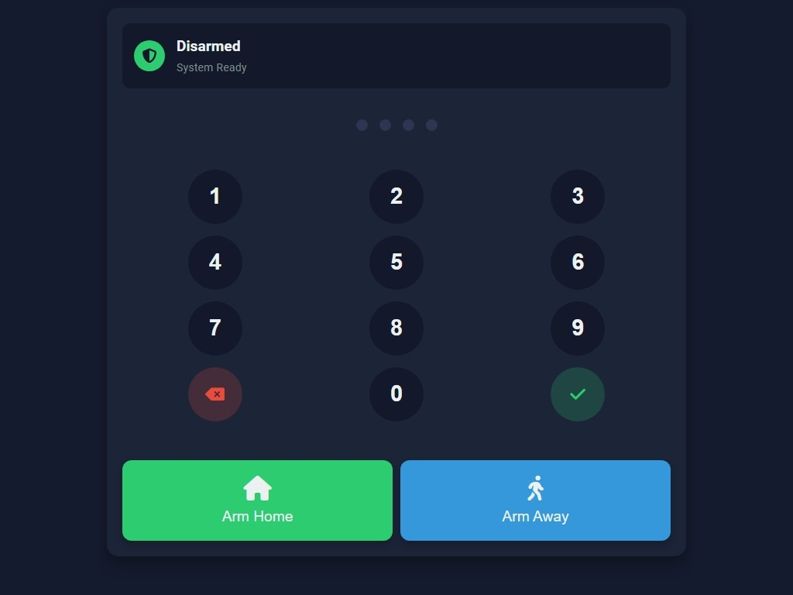

# Alarmo + HomeAssistant MQTT Keypad
Node.js app that serves as a modern keypad for controlling Alarmo via MQTT while querying HomeAssistant sensors. The application is designed to run in a Docker container and provides a user-friendly HTML webpage that can be accessed on a wall mounted iPad or any other device with a web browser.

## Sample Keypad


## Project Structure

```
HomeAssistant/AlarmControl/
├── src
│   ├── public
│   │   ├── css
│   │   │   └── styles.css        # CSS styles for the application
│   │   ├── js
│   │   │   └── main.js           # Client-side JavaScript functionality
│   │   ├── sounds                # Audio feedback for user interactions
│   │   │   ├── action.wav
│   │   │   ├── armed.wav
│   │   │   ├── disarmed.wav
│   │   │   ├── error.wav
│   │   │   └── keypress.wav
│   │   └── index.html            # Main application HTML
│   ├── api
│   │   ├── alarm.js              # Alarm control API endpoints
│   │   ├── config.js             # Configuration API endpoints
│   │   └── sensors.js            # Sensor state API endpoints
│   ├── server.js                 # Express.js server entry point
│   └── config.js                 # Default application configuration
├── Dockerfile                    # Docker container definition
├── package.json                  # npm dependencies and scripts
├── package-lock.json             # Dependency lock file
├── .env                          # Environment variables (not in repo)
└── README.md                     # Project documentation
```

## Getting Started

### Prerequisites

- Node.js and npm (for local development)
- Home Assistant instance with REST API and WebSocket API enabled
- (Optional) Docker and Docker Compose for containerized deployment

### Installation

1. Clone the repository:
   ```
      git clone https://github.com/leecbryant/HomeAssistant-AlarmoKeypad.git
      cd HomeAssistant-AlarmoKeypad
   ```

2. Install dependencies
   ```
      npm install
   ```

3. Copy the `.env.example` to `.env` and fill in the required environment variables.
   ```
      API_URL=http://homeassistant.local/api
      LONG_LIVED_ACCESS_TOKEN=token
      MQTT_BROKER=mqtt://homeassistant
      MQTT_USER=usname
      MQTT_PASSWORD=password
      SENSOR_LIST=[""]
   ```

3. Local Execution
   ```
      npm run dev
   ```

4. Build the Docker image:
   ```
   docker build -t ha-alarmo-keypad .
   ```

5. Run the Docker container:
   ```
   docker run -p 3000:3000 --env-file .env ha-alarmo-keypad
   ```

### Usage

- Access the web interface at http://your-server-ip:3000
- Enter your security code to disarm
- Use the arm buttons to set the system to "Home" or "Away" mode
- The status bar will show any open sensors that might prevent arming
- For sensors that are open, you'll need to press the arming button twice to confirm

### Contributing

Contributions are welcome! Please open an issue or submit a pull request for any enhancements or bug fixes.

### License

This project is licensed under the MIT License. See the LICENSE file for details.